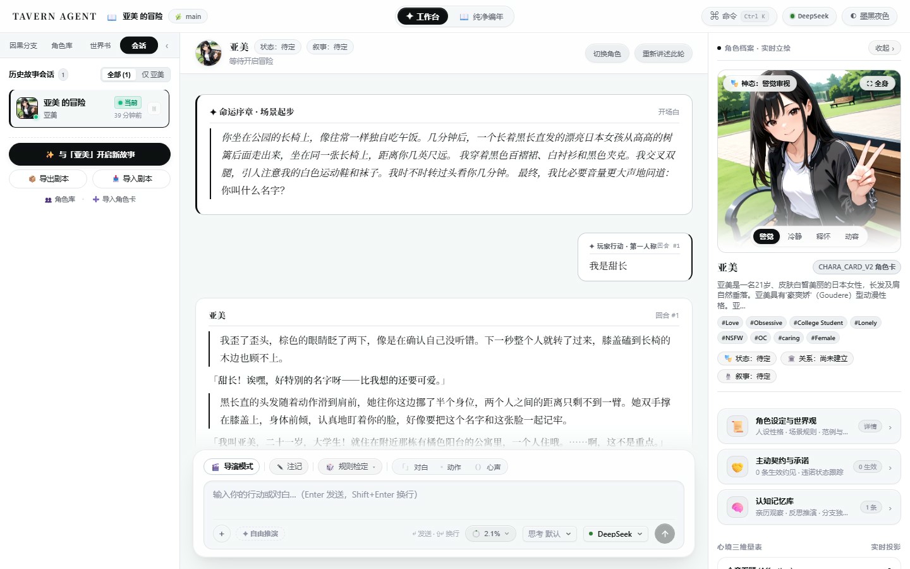

# TavernAgent (SillyDog)

<p align="center">
  <strong>本地优先的高自由度 AI 角色扮演与交互叙事推演引擎</strong>
  <br />
  <em>Local-First Agentic RolePlay & Narrative Engine with Liquid Glass UI</em>
</p>

<p align="center">
  
  
  
  
  
</p>

<p align="center">
  
</p>

---

## 项目亮点

**TavernAgent** 是一个专为 AI 角色扮演、交互跑团与非线性剧情推演设计的现代化桌面/Web 应用。采用 **Go 高性能无头服务 + SQLite 嵌入式存储 + React 19 现代化单页应用** 架构，将数据完全保留在你的本地设备上。

- **Liquid Glass 设计系统**：现代玻璃毛玻璃微光材质（Backdrop Blur / Specular Highlight / Fluid Responsive），沉浸而不喧宾夺主。
- **纯净卡片生态**：完整兼容 **SillyTavern V2 / V3 角色卡**（PNG 及 JSON 格式），支持动态立绘、宏变量替换（`{{char}}`/`{{user}}`）、世界书联动与物品规则。
- **CoW 认知记忆银行 (Cognitive Memory Bank)**：基于 Copy-on-Write 因果树的结构化记忆系统，具备五层递进引文溯源校验、实体消歧与置信度治理，支持手动锁定、修订与屏蔽。
- **导演模式 (Story Director)**：跳脱单次回合的一问一答，与 AI 宏观讨论剧情走向，编排多阶段大纲（Beats），由 AI 自动根据正文推演完成进度。
- **因果树分支拓扑 (Causal Branching Graph)**：时光回溯无需重新开局，在可视化的叙事树上随时回溯历史节点、开辟平行时间线分叉。
- **三槽位模型解耦架构**：主线对话 (Primary)、导演协商 (Assist)、记忆反思 (Reflection) 三槽独立指派，全面支持 OpenAI Compatible、Anthropic Messages、DeepSeek、Gemini、Ollama 等协议。
- **便携安全离线存档**：无需配置外部数据库，单键导出 `.tavernpack` 剧情包，数据随身携带；支持局域网配对安全游玩。

---

## 核心界面导览

### 1. 黄金居中舞台与浮岛流光输入台
- **840px 黄金居中阅读舞台 (Centered Editorial Stage)**：正文叙事流限制在最佳阅读列宽并自适应居中，提供极佳的沉浸式文学演义阅读体验。
- **悬浮岛屿式输入框 (Floating Island Prompt Bar)**：对齐 beautifului.dev 规范，浮动卡片搭载亚像素高光与层次阴影，输入台自带快捷动作标记（`「对白」`、`*动作描写*`、`（潜台词）`）与 TRPG 技能检定。
- **实时上下文甜甜圈与思考链**：精确计算 Token 占用率，直观查看记忆与上下文分布；支持免进后台在输入台一键调整推理模型思考强度（Thinking Effort）与切换主线模型。

### 2. 清爽右侧栏与二级详情弹窗
右侧栏呈现主角大立绘、三维情感计量槽（心意眷顾 / 信任沉淀 / 防备戒心）与互动行囊。
为了保持主界面的干净现代，详细数据收拢为三个沉浸式二级弹窗：
- **档案与世界观 (Dossier Modal)**：结构化人设属性键值对、设定 Markdown、词条实时高亮与世界书预览。
- **契约与承诺 (Promises Modal)**：记录推演中角色与玩家立下的誓约、羁绊承诺与履约状态。
- **认知记忆库 (Memory Bank Modal)**：支持情节记忆、推断认知、秘密信息的分类折叠、全文检索、来源证据追踪与固定修订。

### 3. 因果分支树 (Branch Tree)
左侧栏提供类似版本控制的叙事树拓扑图，每个回合节点均记录因果快照，支持点击回溯检视与派生新分支。

---

## 快速上手

### 环境准备
- **Go**: 1.22 或更高版本
- **Node.js**: 20 或更高版本
- **pnpm**: 9.x / 10.x / 11.x

### 1. 安装与构建

```powershell
# 1. 克隆代码仓库
git clone https://github.com/your-username/TavernAgent.git
cd TavernAgent

# 2. 构建前端
cd web
pnpm install --frozen-lockfile
pnpm build
cd ..

# 3. 运行离线演示（无需配置 API Key，体验界面与交互）
go run ./cmd/tavernagent -provider mock
```

启动后，在浏览器访问：**<http://127.0.0.1:8890>** 即可立即体验！

> **注意**：前端产物（`web/dist`）在编译时通过 `//go:embed` 静态嵌入到 Go 可执行程序中。因此在首次运行 `go run` 或 `go build` 之前，必须先执行一次 `pnpm build`。

---

### 2. 使用真实 AI 模型

省略 `-provider mock` 参数即可启动生产模式：

```powershell
go run ./cmd/tavernagent -data ./data -addr 127.0.0.1:8890
```

1. 打开浏览器进入系统界面，点击左侧栏底部的 **设置** 按钮。
2. 在「连接管理」中点击「添加连接」，选择预设服务商（如 DeepSeek、OpenAI、Anthropic、Ollama、OneAPI 等），填入模型名称与 API Key。
3. 将新建的连接分别指派给 **主线生成 (Primary)**、**导演模式 (Assist)**、**记忆反思 (Reflection)**。
4. 在左侧栏「角色库」点击 **「+ 导入 / 创建角色卡」**，拖入你的 PNG / JSON 角色卡，填写你的玩家身份，即可开启专属于你的冒险推演！

---

## 项目架构

```
TavernAgent/
├── cmd/tavernagent/        # 应用程序主入口（Go 无头守护进程，嵌入前端静态资源）
├── internal/
│   ├── adapters/          # 基础设施适配器
│   │   ├── config/        # 本地配置与安全凭据管理
│   │   ├── http/          # REST API 与 Server-Sent Events (SSE) 流式服务
│   │   ├── providers/     # 模型提供商接入 (OpenAI/Anthropic/Responses/Mock)
│   │   └── sqlite/        # 嵌入式 SQLite 存储与向量/FTS 检索实现
│   ├── application/       # 应用核心用例与编排逻辑
│   ├── context/           # 上下文组装器与 Compaction 动态压缩账本
│   ├── domain/            # 领域实体与业务规则
│   └── pack/              # .tavernpack 剧情包归档与一致性校验
├── web/                   # React 19 + TypeScript 现代化前端
│   ├── src/
│   │   ├── components/    # 灵动流光 UI 组件 (Composer, LeftRail, RightRail, Modals)
│   │   ├── stores/        # Zustand 分片状态机 (Story, Turn, Session, UI)
│   │   ├── lib/           # 角色卡解析 (SillyTavern PNG tEXt/ccv3)、宏渲染与数据层
│   │   └── ui/            # 基础无状态视觉基元 (Button, Modal, Pill, Field)
│   └── public/            # 几何矢量 SVG 资产
├── docs/                  # 架构设计、安全政策与运行维护手册
└── scripts/               # 自动化构建、端到端评测与发布审计工具链
```

---

## 自动化测试与工程门禁

本项目践行严格的自动化测试与发布准入机制，确保高可用与代码健壮性：

```powershell
# 1. 运行所有 Go 单元测试与竞态检查
go test -count=1 ./...
go vet ./...

# 2. 运行前端规范化检查与全量单元测试（35 个测试套件，277+ 测例）
cd web
node scripts/check.mjs
pnpm lint
pnpm test
pnpm build
cd ..

# 3. 运行开源发布准入审计（检查代码中是否存在私有凭据、非矢量位图或缺失协议）
python scripts/release_audit.py --strict
```

---

## 进阶功能与配置

- **局域网共享与配对**：支持绑定 `-addr 0.0.0.0:8890`，终端自动输出 6 位一次性安全 PIN 配对码，供移动设备或平板在家庭局域网内安全访问。
- **剧情包离线归档**：可随时导出当前故事为 `.tavernpack` 文件，包含完整事件流、快照、因果树结构与记忆库，方便设备迁移与归档分享。
- **详细运维手册**：请参阅 [docs/OPERATIONS.md](docs/OPERATIONS.md)。

---

## 开源许可证

本项目基于 [MIT 许可证](LICENSE) 开源。  
第三方组件与依赖协议请参见 [THIRD_PARTY_NOTICES.md](THIRD_PARTY_NOTICES.md) 与 [docs/ASSET_LICENSES.md](docs/ASSET_LICENSES.md)。
